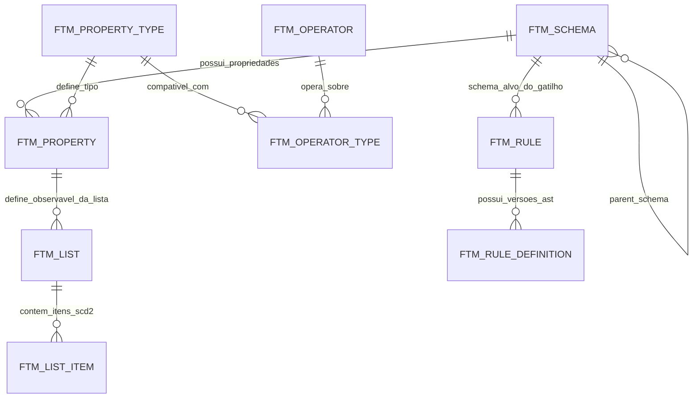

# Modelo de Dados: Regras de Alerta & Ontologia FollowTheMoney (FtM)

Documentação técnica do domínio de **Regras de Alerta** e **Inteligência Fiscal**, gerenciada via Next.js, persistida em PostgreSQL e integrada à Plataforma de Dados Moderna (Kafka, Redis Feature Store, Trino/Iceberg).

O modelo adota os princípios da ontologia internacional **FollowTheMoney (FtM)** ([followthemoney.tech](https://followthemoney.tech/)), modelando documentos, contribuintes, pessoas vinculadas e relacionamentos como grafos semânticos com vigência temporal.

---

## 1. Regras Gerais de Auditoria e Seed

Toda tabela do modelo possui os 5 campos de auditoria padrão do sistema, com chaves estrangeiras apontando para a tabela `usuario`:

| Coluna | Tipo | Chave / Restrição | Descrição |
| :--- | :--- | :--- | :--- |
| `criado_por` | UUIDv7 | FK(`Usuario.usr_id`) NOT NULL | Identificador do usuário que criou o registro |
| `atualizado_por` | UUIDv7 | FK(`Usuario.usr_id`) NOT NULL | Identificador do usuário que realizou a última alteração |
| `criado_em` | timestamp | NOT NULL | Data e hora de criação do registro |
| `atualizado_em` | timestamp | NOT NULL | Data e hora da última modificação |
| `deletado_em` | timestamp | NULL | Flag de soft-delete (NULL = registro válido) |

### Valores Padrão para Carga de Seed:
| criado_por | atualizado_por | criado_em | atualizado_em | deletado_em |
| :--- | :--- | :--- | :--- | :--- |
| `019c0b11-a400-7000-8000-000000000000` | `019c0b11-a400-7000-8000-000000000000` | timestamp atual | timestamp atual | NULL |

---

## 2. Visão Conceitual FtM: Entidades, Relacionamentos e Observáveis

### 2.1. Schemas e Herança
- **`Thing`**: Schema raiz abstrato (contém `name`, `description`, etc.).
- **`LegalEntity`**: Base para entidades com personalidade jurídica ou física (contém `taxNumber`, `stateRegistration`, `status`, `country`).
- **`Person`** (herda de `LegalEntity`): Pessoa natural com CPF, data de nascimento e profissão.
- **`Company`** (herda de `LegalEntity`): Empresa/contribuinte com CNPJ, regime tributário, capital social, tempo de abertura e faturamento acumulado.
- **`FiscalDocument`** (herda de `Thing`): Eventos de emissão de NF-e, NFC-e, CT-e, MDF-e, NFCom, NF3e.
- **`TaxDeclaration`** (herda de `Thing`): Declarações fiscais (PGDASD, EFD, DSTDA).

### 2.2. Arestas com Vigência Temporal (Edges)
Relacionamentos são entidades de primeira classe com controle de vigência (SCD Tipo 2):
- **`AccountingService`**: Vínculo entre Contribuinte (`client`) e Contador (`accountant`) com `startDate` e `endDate`.
- **`Ownership`**: Vínculo societário entre Empresa (`asset`) e Sócio (`owner`) com percentual de cotas, `startDate` e `endDate`.
- **`Directorship`**: Vínculo de administração entre Empresa e Administrador.

### 2.3. Resolução da Explosão Combinatória via Navegação em Grafo
Em vez de cadastrar fatos planos repetidos (`nfe.emit.contador.cpf`, `cte.rem.contador.cpf`), o fato `taxNumber` é cadastrado **uma única vez** na entidade `LegalEntity`. A regra de alerta navega semanticamente no grafo:
- `emitter.accountant.taxNumber` -> Acessa o CPF do contador do emitente.
- `receiver.tempoAberturaDias` -> Acessa o tempo de abertura do destinatário.
- `shareholders.taxNumber` -> Acessa o CNPJ/CPF dos sócios da empresa.

---

## 3. Diagrama Entidade-Relacionamento (ERD)



---

## 4. Dicionário de Tabelas do Modelo Relacional

### Tabela: `ftm_schema`
Catálogo de Schemas de Entidades e Relacionamentos FtM.

| Coluna | Tipo | Chave / Restrição | Descrição |
| :--- | :--- | :--- | :--- |
| `schema_id` | inteiro | PK | Id do schema |
| `schema_name` | string(60) | NOT NULL, UNIQUE | Nome técnico (`Thing`, `LegalEntity`, `Person`, `Company`, `FiscalDocument`, `TaxDeclaration`, `AccountingService`, `Ownership`, `Directorship`) |
| `parent_schema_id` | inteiro | FK(`ftm_schema.schema_id`) NULL | Schema pai do qual herda propriedades |
| `schema_label` | string(100) | NOT NULL | Nome legível na interface |
| `schema_desc` | string | NOT NULL | Descrição semântica do schema |
| `is_edge` | boolean | NOT NULL DEFAULT false | `true` se for relacionamento com vigência, `false` se for entidade |
| `criado_por` | UUIDv7 | FK(`Usuario.usr_id`) NOT NULL | Auditoria |
| `atualizado_por` | UUIDv7 | FK(`Usuario.usr_id`) NOT NULL | Auditoria |
| `criado_em` | timestamp | NOT NULL | Auditoria |
| `atualizado_em` | timestamp | NOT NULL | Auditoria |
| `deletado_em` | timestamp | NULL | Auditoria |

---

### Tabela: `ftm_property_type`
Tipos de dados primitivos e semânticos suportados pelo FtM.

| Coluna | Tipo | Chave / Restrição | Descrição |
| :--- | :--- | :--- | :--- |
| `type_id` | inteiro | PK | Id do tipo de dado |
| `type_name` | string(30) | NOT NULL, UNIQUE | Código FtM (`string`, `number`, `integer`, `boolean`, `date`, `timestamp`, `identifier`, `entity`, `address`, `phone`, `email`, `topic`) |
| `type_label` | string(100) | NOT NULL | Rótulo amigável na UI |
| `type_desc` | string | NOT NULL | Descrição e padrão de validação |
| `criado_por` | UUIDv7 | FK(`Usuario.usr_id`) NOT NULL | Auditoria |
| `atualizado_por` | UUIDv7 | FK(`Usuario.usr_id`) NOT NULL | Auditoria |
| `criado_em` | timestamp | NOT NULL | Auditoria |
| `atualizado_em` | timestamp | NOT NULL | Auditoria |
| `deletado_em` | timestamp | NULL | Auditoria |

---

### Tabela: `ftm_property`
Propriedades (Fatos e Relacionamentos) pertencentes a cada Schema.

| Coluna | Tipo | Chave / Restrição | Descrição |
| :--- | :--- | :--- | :--- |
| `property_id` | inteiro | PK | Id da propriedade |
| `schema_id` | inteiro | FK(`ftm_schema.schema_id`) NOT NULL | Schema proprietário |
| `property_name` | string(60) | NOT NULL | Nome técnico em camelCase (`taxNumber`, `amount`, `capital`, `emitter`, `accountant`, etc.) |
| `property_label` | string(100) | NOT NULL | Rótulo amigável na UI (ex: "CNPJ / CPF", "Valor Total") |
| `property_desc` | string | NOT NULL | Descrição fiscal e origem do dado |
| `type_id` | inteiro | FK(`ftm_property_type.type_id`) NOT NULL | Tipo do dado |
| `target_schema_id`| inteiro | FK(`ftm_schema.schema_id`) NULL | Schema de destino se `type_id == 'entity'` |
| `is_multi` | boolean | NOT NULL DEFAULT false | Se aceita array/múltiplos valores |
| `is_observable` | boolean | NOT NULL DEFAULT false | Se é um observável investigativo indexado em listas |
| `property_status` | `ftm_status_enum` | NOT NULL DEFAULT 'ATIVA' | Enum: `EM_TESTE`, `ATIVA`, `SUSPENSA`, `ARQUIVADA` |
| `criado_por` | UUIDv7 | FK(`Usuario.usr_id`) NOT NULL | Auditoria |
| `atualizado_por` | UUIDv7 | FK(`Usuario.usr_id`) NOT NULL | Auditoria |
| `criado_em` | timestamp | NOT NULL | Auditoria |
| `atualizado_em` | timestamp | NOT NULL | Auditoria |
| `deletado_em` | timestamp | NULL | Auditoria |

#### `ftm_status_enum` (Situação da Propriedade / Lista)
| Valor | Descrição |
| :--- | :--- |
| `EM_TESTE` | Disponível apenas em modo de homologação / simulação |
| `ATIVA` | Disponível para utilização em regras de produção |
| `SUSPENSA` | Temporariamente desabilitada para novas regras |
| `ARQUIVADA` | Obsoleta, mantida apenas para auditoria histórica |

---

### Tabela: `ftm_operator`
Catálogo de operadores lógicos e relacionais disponíveis no motor.

| Coluna | Tipo | Chave / Restrição | Descrição |
| :--- | :--- | :--- | :--- |
| `operator_id` | inteiro | PK | Id do operador |
| `operator_code` | string(40) | NOT NULL, UNIQUE | Código técnico (`EQUAL`, `NOT_EQUAL`, `GREATER_THAN`, `LESS_THAN`, `GREATER_THAN_OR_EQUAL`, `LESS_THAN_OR_EQUAL`, `IN_LIST`, `NOT_IN_LIST`, `CONTAINS`, `STARTS_WITH`, `ENDS_WITH`, `EXISTS`, `BETWEEN`) |
| `operator_symbol` | string(20) | NOT NULL | Símbolo na interface (`=`, `!=`, `>`, `<`, `>=`, `<=`, `na lista`, `não na lista`, `contém`, `existe`) |
| `operator_label` | string(60) | NOT NULL | Nome legível (ex: "Maior que", "Presente na Lista", "Igual a") |
| `operator_desc` | string | NOT NULL | Descrição do comportamento lógico |
| `requires_value` | boolean | NOT NULL DEFAULT true | Se requer preenchimento de valor constante |
| `requires_list` | boolean | NOT NULL DEFAULT false | Se requer seleção de uma Watchlist dinâmica |
| `criado_por` | UUIDv7 | FK(`Usuario.usr_id`) NOT NULL | Auditoria |
| `atualizado_por` | UUIDv7 | FK(`Usuario.usr_id`) NOT NULL | Auditoria |
| `criado_em` | timestamp | NOT NULL | Auditoria |
| `atualizado_em` | timestamp | NOT NULL | Auditoria |
| `deletado_em` | timestamp | NULL | Auditoria |

---

### Tabela: `ftm_operator_type`
Matriz de compatibilidade entre Operadores e Tipos de Propriedade.

| Coluna | Tipo | Chave / Restrição | Descrição |
| :--- | :--- | :--- | :--- |
| `operator_id` | inteiro | PK Composta / FK(`ftm_operator.operator_id`) NOT NULL | Identificador do operador |
| `type_id` | inteiro | PK Composta / FK(`ftm_property_type.type_id`) NOT NULL | Identificador do tipo de dado compatível |
| `criado_por` | UUIDv7 | FK(`Usuario.usr_id`) NOT NULL | Auditoria |
| `atualizado_por` | UUIDv7 | FK(`Usuario.usr_id`) NOT NULL | Auditoria |
| `criado_em` | timestamp | NOT NULL | Auditoria |
| `atualizado_em` | timestamp | NOT NULL | Auditoria |
| `deletado_em` | timestamp | NULL | Auditoria |

---

### Tabela: `ftm_list`
Watchlists de Observáveis (Listas Dinâmicas de CNPJs, CPFs, CNAEs, etc.).

| Coluna | Tipo | Chave / Restrição | Descrição |
| :--- | :--- | :--- | :--- |
| `list_id` | inteiro | PK | Id da lista |
| `list_code` | string(60) | NOT NULL, UNIQUE | Código identificador (ex: `LST_CNPJ_NOTEIRAS`, `LST_CONTADORES_ALVO_INVESTIGACAO`) |
| `list_name` | string(100) | NOT NULL | Nome descritivo da lista |
| `list_desc` | string | NOT NULL | Motivo de existência, finalidade e regulamentação da lista |
| `property_id` | inteiro | FK(`ftm_property.property_id`) NOT NULL | Propriedade/observável que a lista armazena (ex: `taxNumber`, `crc`) |
| `list_status` | `ftm_status_enum` | NOT NULL DEFAULT 'ATIVA' | Situação da lista (`ATIVA`, `INATIVA`, `ARQUIVADA`) |
| `criado_por` | UUIDv7 | FK(`Usuario.usr_id`) NOT NULL | Auditoria |
| `atualizado_por` | UUIDv7 | FK(`Usuario.usr_id`) NOT NULL | Auditoria |
| `criado_em` | timestamp | NOT NULL | Auditoria |
| `atualizado_em` | timestamp | NOT NULL | Auditoria |
| `deletado_em` | timestamp | NULL | Auditoria |

---

### Tabela: `ftm_list_item`
Itens da Lista com Histórico Temporal (SCD Tipo 2) e Governança.

| Coluna | Tipo | Chave / Restrição | Descrição |
| :--- | :--- | :--- | :--- |
| `list_item_id` | inteiro | PK | Id do registro de inclusão do item |
| `list_id` | inteiro | FK(`ftm_list.list_id`) NOT NULL | Lista associada |
| `item_value` | string(255) | NOT NULL | Valor do observável (ex: `04123456000178`, `12345678900`) |
| `item_reason_in` | string | NOT NULL | Justificativa / Número do Processo / Operação da inclusão |
| `item_reason_out` | string | NULL | Justificativa preenchida no momento do encerramento da vigência |
| `valid_from` | timestamp | NOT NULL | Timestamp de início da vigência do item na lista |
| `valid_to` | timestamp | NULL | Timestamp de encerramento da vigência (NULL = item ativo/vigente) |
| `criado_por` | UUIDv7 | FK(`Usuario.usr_id`) NOT NULL | Auditoria |
| `atualizado_por` | UUIDv7 | FK(`Usuario.usr_id`) NOT NULL | Auditoria |
| `criado_em` | timestamp | NOT NULL | Auditoria |
| `atualizado_em` | timestamp | NOT NULL | Auditoria |
| `deletado_em` | timestamp | NULL | Auditoria |

---

### Tabela: `ftm_action`
Catálogo de Ações e Canais disparados pelo Motor de Regras.

| Coluna | Tipo | Chave / Restrição | Descrição |
| :--- | :--- | :--- | :--- |
| `action_id` | inteiro | PK | Id da ação |
| `action_code` | string(40) | NOT NULL, UNIQUE | Código da ação (`INDICACAO_TELA`, `ALERTA_TELEGRAM`, `GERAR_OS`, `FLAG_MALHA`, `EMAIL`, `PRODOC`, `ADD_TO_WATCHLIST`) |
| `action_name` | string(60) | NOT NULL | Nome amigável na interface |
| `action_desc` | string | NOT NULL | Descrição do comportamento e integrações acionadas |
| `criado_por` | UUIDv7 | FK(`Usuario.usr_id`) NOT NULL | Auditoria |
| `atualizado_por` | UUIDv7 | FK(`Usuario.usr_id`) NOT NULL | Auditoria |
| `criado_em` | timestamp | NOT NULL | Auditoria |
| `atualizado_em` | timestamp | NOT NULL | Auditoria |
| `deletado_em` | timestamp | NULL | Auditoria |

---

### Tabela: `ftm_rule`
Cabeçalho da Regra de Alerta Fiscal.

| Coluna | Tipo | Chave / Restrição | Descrição |
| :--- | :--- | :--- | :--- |
| `rule_id` | inteiro | PK | Id da regra |
| `rule_code` | string(30) | NOT NULL, UNIQUE | Código da regra no padrão `CAT_0000` (ex: `NFE_0001`, `CAD_0002`) |
| `rule_name` | string(100) | NOT NULL | Nome da regra |
| `rule_desc` | string | NOT NULL | Descrição do objetivo fiscal da regra |
| `target_schema_id`| inteiro | FK(`ftm_schema.schema_id`) NOT NULL | Schema do evento raiz disparador (`FiscalDocument`, `Company`, `TaxDeclaration`) |
| `rule_status` | `ftm_rule_status_enum`| NOT NULL DEFAULT 'RASCUNHO' | Situação operacional da regra |
| `priority` | inteiro | NOT NULL DEFAULT 100 | Precedência no motor de execução (1 a 1000) |
| `criado_por` | UUIDv7 | FK(`Usuario.usr_id`) NOT NULL | Auditoria |
| `atualizado_por` | UUIDv7 | FK(`Usuario.usr_id`) NOT NULL | Auditoria |
| `criado_em` | timestamp | NOT NULL | Auditoria |
| `atualizado_em` | timestamp | NOT NULL | Auditoria |
| `deletado_em` | timestamp | NULL | Auditoria |

#### `ftm_rule_status_enum` (Situação da Regra)
| Valor | Descrição |
| :--- | :--- |
| `RASCUNHO` | Regra em elaboração, não carregada pelos workers |
| `EM_TESTE` | Regra em homologação (executa em modo simulação/dry-run contra eventos) |
| `ATIVA` | Regra ativa e gerando alertas em produção |
| `INATIVA` | Regra suspensa manualmente |
| `ERRO` | Regra com erro de validação semântica |
| `ARQUIVADA` | Regra obsoleta mantida para histórico |

---

### Tabela: `ftm_rule_definition`
Versionamento Imutável da Lógica da Regra (AST em JSONB) e Vigência.

| Coluna | Tipo | Chave / Restrição | Descrição |
| :--- | :--- | :--- | :--- |
| `rule_id` | inteiro | PK Composta / FK(`ftm_rule.rule_id`) | Id da regra |
| `rule_version` | inteiro | PK Composta | Versão sequencial (1, 2, 3...) |
| `definition` | jsonb | NOT NULL | Árvore AST em formato JSON validada via Zod |
| `valid_from` | timestamp | NOT NULL | Timestamp de início da vigência da versão |
| `valid_to` | timestamp | NULL | Timestamp de término da vigência (NULL = versão em vigor) |
| `criado_por` | UUIDv7 | FK(`Usuario.usr_id`) NOT NULL | Auditoria |
| `atualizado_por` | UUIDv7 | FK(`Usuario.usr_id`) NOT NULL | Auditoria |
| `criado_em` | timestamp | NOT NULL | Auditoria |
| `atualizado_em` | timestamp | NOT NULL | Auditoria |
| `deletado_em` | timestamp | NULL | Auditoria |

---

## 5. Especificação da AST JSONB & Schemas Zod (`rule-ast.schema.ts`)

A validação da árvore de condições e ações da DSL em TypeScript / Next.js é implementada com Zod recursivo:

```typescript
import { z } from 'zod';

// 1. Operadores suportados
export const FtmOperatorSchema = z.enum([
  'EQUAL',
  'NOT_EQUAL',
  'GREATER_THAN',
  'GREATER_THAN_OR_EQUAL',
  'LESS_THAN',
  'LESS_THAN_OR_EQUAL',
  'IN',
  'NOT_IN',
  'IN_LIST',
  'NOT_IN_LIST',
  'CONTAINS',
  'STARTS_WITH',
  'ENDS_WITH',
  'EXISTS',
  'NOT_EXISTS',
  'BETWEEN',
]);

// 2. Caminho da Propriedade em Notação de Grafo (ex: "amount", "emitter.accountant.taxNumber")
export const FtmPropertyPathSchema = z
  .string()
  .min(1)
  .regex(/^[a-zA-Z0-9_]+(\.[a-zA-Z0-9_]+)*$/, {
    message: 'O caminho da propriedade deve seguir o padrão: "propriedade" ou "entidade.relacionamento.propriedade"',
  });

// 3. Condição Atômica com Valor Literal
export const FtmAtomicConditionSchema = z.object({
  path: FtmPropertyPathSchema,
  operator: FtmOperatorSchema,
  value: z.union([
    z.string(),
    z.number(),
    z.boolean(),
    z.array(z.union([z.string(), z.number()])),
    z.null(),
  ]).optional(),
  list_id: z.number().int().optional(),
  list_code: z.string().optional(),
});

// 4. Interface Recursiva do Nó de Condições
export type FtmConditionNode =
  | z.infer<typeof FtmAtomicConditionSchema>
  | { all: FtmConditionNode[] }
  | { any: FtmConditionNode[] }
  | { not: FtmConditionNode };

// 5. Schema Recursivo Zod com z.lazy()
export const FtmConditionSchema: z.ZodType<FtmConditionNode> = z.lazy(() =>
  z.union([
    FtmAtomicConditionSchema,
    z.object({
      all: z.array(FtmConditionSchema).min(1, 'Bloco "all" (E) deve ter ao menos 1 condição'),
    }).strict(),
    z.object({
      any: z.array(FtmConditionSchema).min(1, 'Bloco "any" (OU) deve ter ao menos 1 condição'),
    }).strict(),
    z.object({
      not: FtmConditionSchema,
    }).strict(),
  ])
);

// 6. Schema de Ação Disparada
export const FtmActionTriggerSchema = z.object({
  type: z.enum([
    'INDICACAO_TELA',
    'ALERTA_TELEGRAM',
    'GERAR_OS',
    'FLAG_MALHA',
    'EMAIL',
    'PRODOC',
    'ADD_TO_WATCHLIST',
  ]),
  severity: z.enum(['BAIXA', 'MEDIA', 'ALTA', 'CRITICA']).default('MEDIA'),
  params: z.record(z.unknown()).default({}),
});

// 7. Schema Completo da AST de Regra FtM
export const FtmRuleDefinitionAstSchema = z.object({
  version: z.string().default('1.0'),
  name: z.string().min(3),
  target_schema: z.string().min(1),
  conditions: FtmConditionSchema,
  actions: z.array(FtmActionTriggerSchema).min(1, 'A regra precisa ter ao menos uma ação configurada'),
});

export type FtmRuleDefinitionAst = z.infer<typeof FtmRuleDefinitionAstSchema>;
```

---

## 6. Exemplos Reais de JSONB e Payloads de Eventos

### Exemplo 1: Regra com Navegação em Grafo FtM (`FiscalDocument` -> `emitter` -> `accountant`)
> **Cenário**: NF-e com valor superior a R$ 50.000,00 emitida por empresa cujo contador consta na Watchlist de contadores investigados, destinada a uma empresa recém-aberta (< 60 dias).

```json
{
  "version": "1.0",
  "name": "NFe de Alto Valor com Contador em Lista de Investigação",
  "target_schema": "FiscalDocument",
  "conditions": {
    "all": [
      {
        "path": "amount",
        "operator": "GREATER_THAN",
        "value": 50000.00
      },
      {
        "path": "emitter.accountant.crc",
        "operator": "IN_LIST",
        "list_id": 102,
        "list_code": "LST_CONTADORES_ALVO_OP_CADEADO"
      },
      {
        "path": "receiver.tempoAberturaDias",
        "operator": "LESS_THAN",
        "value": 60
      }
    ]
  },
  "actions": [
    {
      "type": "GERAR_OS",
      "severity": "ALTA",
      "params": {
        "tipo_intervencao": "VISTORIA_TRANSITO",
        "mensagem": "NFe emitida por empresa vinculada a contador sob investigação para destinatário recém-aberto."
      }
    },
    {
      "type": "ALERTA_TELEGRAM",
      "severity": "ALTA",
      "params": {
        "canal": "PLANTÃO_FISCAL"
      }
    }
  ]
}
```

---

### Exemplo 2: Regra sobre Mudança Cadastral (`Company` -> `shareholders`)
> **Cenário**: Alteração societária na qual ingressa sócio registrado na Watchlist de "Sócios Laranjas Conhecidos".

```json
{
  "version": "1.0",
  "name": "Alteração Societária com Inclusão de Sócio Laranja",
  "target_schema": "Company",
  "conditions": {
    "all": [
      {
        "path": "shareholders.taxNumber",
        "operator": "IN_LIST",
        "list_id": 103,
        "list_code": "LST_SOCIOS_LARANJAS_CONHECIDOS"
      },
      {
        "path": "capital",
        "operator": "GREATER_THAN",
        "value": 100000.00
      }
    ]
  },
  "actions": [
    {
      "type": "FLAG_MALHA",
      "severity": "CRITICA",
      "params": {
        "score_risco": 95,
        "motivo": "Empresa com capital elevado tendo sócio em lista de fraude cadastral."
      }
    }
  ]
}
```

---

### Exemplo 3: Payload de Evento FtM no Kafka (`FiscalDocument` Enriquecido)

```json
{
  "id": "dfe-nfe-16260804123456000178550010000000011000000010",
  "schema": "FiscalDocument",
  "properties": {
    "documentType": ["NFE"],
    "accessKey": ["16260804123456000178550010000000011000000010"],
    "date": ["2026-08-20T14:30:00Z"],
    "amount": [120000.00],
    "taxAmount": [14400.00],
    "cfop": ["5102"],
    "emitter": {
      "id": "br-cnpj-04123456000178",
      "schema": "Company",
      "properties": {
        "name": ["BEBIDAS NORTE LTDA"],
        "taxNumber": ["04123456000178"],
        "stateRegistration": ["030123456"],
        "tempoAberturaDias": [45],
        "regimeTributario": ["SIMPLES_NACIONAL"],
        "accountant": {
          "id": "br-cpf-12345678900",
          "schema": "Person",
          "properties": {
            "name": ["JOAO DO CARMO SILVA"],
            "taxNumber": ["12345678900"],
            "crc": ["AP-004512/O"]
          }
        }
      }
    },
    "receiver": {
      "id": "br-cnpj-98765432000199",
      "schema": "Company",
      "properties": {
        "name": ["DISTRIBUIDORA MACAPA LTDA"],
        "taxNumber": ["98765432000199"],
        "tempoAberturaDias": [30],
        "status": ["HABILITADO"]
      }
    }
  }
}
```

---

## 7. Recomendações e Melhores Práticas em Plataformas de Dados Modernas

1. **Pipeline de Eventos em Tempo Real (Kafka + Schema Registry)**:
   - Tópicos de documentos fiscais (`dfe.nfe.events`, `dfe.cte.events`) e cadastrais (`sate.cadastro.events`) particionados pela chave do contribuinte (`emit.cnpj_raiz` ou `accessKey`).
   - Contratos de esquema garantidos via Avro / Protobuf alinhados às definições dos schemas FtM.
2. **Avaliação de Regras com Latência < 1ms (Stream Engine + Redis Feature Store)**:
   - O worker stream consome o evento e enriquece os nós relacionados (ex: `emitter.accountant`) consultando o **Redis** (`HGETALL cad:cnpj:<cnpj>`).
   - As Watchlists (`ftm_list`) ficam carregadas em Redis Sets (`SISMEMBER list:<list_code> <observavel>`), permitindo testes `IN_LIST` instantâneos em memória.
3. **Change Data Capture (CDC via Debezium / PgOutput)**:
   - Qualquer inserção ou encerramento de item em `ftm_list_item` ou atualização em `ftm_rule_definition` gera um evento CDC que invalida o cache do Redis em milissegundos sem necessidade de reinício dos workers.
4. **Simulação e Backtesting no Lakehouse (Apache Iceberg + Trino)**:
   - Regras em situação `EM_TESTE` podem ser executadas em lote contra meses de dados históricos persistidos no Lakehouse (MinIO/S3 + Iceberg) via Trino SQL para avaliar taxa de falsos-positivos e impacto antes da ativação em produção.
5. **Deduplicação e Idempotência**:
   - Chave de deduplicação de alertas gerados: `SHA256(rule_id, rule_version, target_entity_id, janela_tempo)` para evitar múltiplos alertas para o mesmo evento.

---

## 8. Carga Inicial de Seeds (Datasets FtM)

### SEED: `ftm_schema`
| schema_id | schema_name | parent_schema_id | schema_label | is_edge | schema_desc |
| :--- | :--- | :--- | :--- | :--- | :--- |
| 1 | `Thing` | NULL | Objeto Base | false | Entidade raiz de todos os objetos |
| 2 | `LegalEntity` | 1 | Pessoa Jurídica / Física | false | Entidade com identificação fiscal no país |
| 3 | `Person` | 2 | Pessoa Física | false | Pessoa natural com CPF |
| 4 | `Company` | 2 | Empresa / Contribuinte | false | Pessoa jurídica inscrita no CNPJ |
| 5 | `FiscalDocument` | 1 | Documento Fiscal Eletrônico | false | NF-e, NFC-e, CT-e, MDF-e, NFCom, NF3e |
| 6 | `TaxDeclaration` | 1 | Declaração Fiscal | false | PGDASD, EFD, DSTDA |
| 7 | `AccountingService`| 1 | Serviço Contábil | true | Vínculo entre Contribuinte e Contador com vigência |
| 8 | `Ownership` | 1 | Participação Societária | true | Vínculo societário entre Empresa e Sócio com cotas e vigência |
| 9 | `Directorship` | 1 | Administração | true | Cargo de administrador exercido por pessoa física |

---

### SEED: `ftm_property_type`
| type_id | type_name | type_label | type_desc |
| :--- | :--- | :--- | :--- |
| 1 | `string` | Texto | Cadeia de caracteres de texto livre |
| 2 | `number` | Numérico Decimal | Ponto flutuante para valores monetários e alíquotas |
| 3 | `integer` | Inteiro | Número inteiro (quantidades, dias, contadores) |
| 4 | `boolean` | Booleano | Verdadeiro ou Falso |
| 5 | `date` | Data | Data no formato ISO AAAA-MM-DD |
| 6 | `timestamp` | Data e Hora | Timestamp UTC com milissegundos |
| 7 | `identifier` | Identificador / Observável | CNPJ, CPF, Inscrição Estadual, Chave NFe, CRC |
| 8 | `entity` | Referência a Entidade | Aponta para outra entidade do grafo FtM |
| 9 | `address` | Endereço | Logradouro, Bairro, CEP e Município |
| 10 | `phone` | Telefone | Número de contato telefônico |
| 11 | `email` | E-mail | Endereço eletrônico |

---

### SEED: `ftm_operator`
| operator_id | operator_code | operator_symbol | operator_label | requires_value | requires_list | operator_desc |
| :--- | :--- | :--- | :--- | :--- | :--- | :--- |
| 1 | `EQUAL` | `=` | Igual a | true | false | Comparação exata de igualdade |
| 2 | `NOT_EQUAL` | `!=` | Diferente de | true | false | Comparação de não-igualdade |
| 3 | `GREATER_THAN` | `>` | Maior que | true | false | Maior que (números, datas) |
| 4 | `GREATER_THAN_OR_EQUAL` | `>=` | Maior ou igual a | true | false | Maior ou igual |
| 5 | `LESS_THAN` | `<` | Menor que | true | false | Menor que (números, datas) |
| 6 | `LESS_THAN_OR_EQUAL` | `<=` | Menor ou igual a | true | false | Menor ou igual |
| 7 | `IN` | `em` | Contido no conjunto | true | false | O valor está em uma lista literal de constantes |
| 8 | `NOT_IN` | `não em` | Não contido no conjunto | true | false | O valor não está na lista literal |
| 9 | `IN_LIST` | `na lista` | Presente na Watchlist | false | true | O observável pertence a uma Watchlist ativa |
| 10 | `NOT_IN_LIST` | `não na lista` | Não presente na Watchlist | false | true | O observável não pertence à Watchlist |
| 11 | `CONTAINS` | `contém` | Contém texto | true | false | Substring presente no texto |
| 12 | `STARTS_WITH` | `começa com` | Começa com | true | false | Prefixo de texto |
| 13 | `ENDS_WITH` | `termina com` | Termina com | true | false | Sufixo de texto |
| 14 | `EXISTS` | `preenchido` | Campo existe / não nulo | false | false | Campo preenchido |
| 15 | `BETWEEN` | `entre` | Intervalo fechado | true | false | Valor dentro de faixa min/max |

---

### SEED: `ftm_operator_type`
| operator_id | type_id |
| :--- | :--- |
| 1 (`EQUAL`), 2 (`NOT_EQUAL`) | 1 (`string`), 2 (`number`), 3 (`integer`), 4 (`boolean`), 5 (`date`), 6 (`timestamp`), 7 (`identifier`) |
| 3 (`GREATER_THAN`), 4 (`GTE`), 5 (`LESS_THAN`), 6 (`LTE`), 15 (`BETWEEN`) | 2 (`number`), 3 (`integer`), 5 (`date`), 6 (`timestamp`) |
| 7 (`IN`), 8 (`NOT_IN`) | 1 (`string`), 2 (`number`), 3 (`integer`), 7 (`identifier`) |
| 9 (`IN_LIST`), 10 (`NOT_IN_LIST`) | 7 (`identifier`), 1 (`string`), 10 (`phone`), 11 (`email`) |
| 11 (`CONTAINS`), 12 (`STARTS_WITH`), 13 (`ENDS_WITH`) | 1 (`string`), 9 (`address`), 11 (`email`) |
| 14 (`EXISTS`) | Todos os tipos (1 a 11) |

---

### SEED: `ftm_property`
| property_id | schema_id | property_name | property_label | type_id | target_schema_id | is_multi | is_observable | property_status | property_desc |
| :--- | :--- | :--- | :--- | :--- | :--- | :--- | :--- | :--- | :--- |
| 1 | 2 (`LegalEntity`) | `taxNumber` | CNPJ / CPF | 7 (`identifier`) | NULL | false | true | ATIVA | Identificador fiscal principal do contribuinte ou pessoa física |
| 2 | 2 (`LegalEntity`) | `name` | Razão Social / Nome | 1 (`string`) | NULL | false | false | ATIVA | Nome oficial registrado |
| 3 | 2 (`LegalEntity`) | `stateRegistration` | Inscrição Estadual (IE) | 7 (`identifier`) | NULL | false | true | ATIVA | Inscrição estadual junto à SEFAZ |
| 4 | 2 (`LegalEntity`) | `status` | Situação Cadastral | 1 (`string`) | NULL | false | false | ATIVA | Situação (HABILITADO, SUSPENSO, CANCELADO, BAIXADO) |
| 5 | 2 (`LegalEntity`) | `email` | E-mail de Contato | 11 (`email`) | NULL | true | true | ATIVA | E-mail registrado no cadastro |
| 6 | 2 (`LegalEntity`) | `phone` | Telefone | 10 (`phone`) | NULL | true | true | ATIVA | Telefone registrado |
| 7 | 3 (`Person`) | `birthDate` | Data de Nascimento | 5 (`date`) | NULL | false | false | ATIVA | Data de nascimento da pessoa física |
| 8 | 3 (`Person`) | `crc` | Registro CRC | 7 (`identifier`) | NULL | false | true | ATIVA | Registro do Conselho Regional de Contabilidade |
| 9 | 4 (`Company`) | `incorporationDate` | Data de Abertura | 5 (`date`) | NULL | false | false | ATIVA | Data de constituição na Junta Comercial |
| 10 | 4 (`Company`) | `tempoAberturaDias` | Dias desde a Abertura | 3 (`integer`) | NULL | false | false | ATIVA | Dias decorridos desde a constituição |
| 11 | 4 (`Company`) | `capital` | Capital Social | 2 (`number`) | NULL | false | false | ATIVA | Capital social integralizado |
| 12 | 4 (`Company`) | `regimeEstadual` | Regime Estadual | 1 (`string`) | NULL | false | false | ATIVA | Regime estadual (NORMAL, SUBSTITUTO, ISENTO) |
| 13 | 4 (`Company`) | `regimeFederal` | Regime Federal | 1 (`string`) | NULL | false | false | ATIVA | Regime federal (SIMPLES_NACIONAL, LUCRO_PRESUMIDO, REAL) |
| 14 | 4 (`Company`) | `faturamento12m` | Faturamento 12M | 2 (`number`) | NULL | false | false | ATIVA | Faturamento acumulado nos últimos 12 meses |
| 15 | 4 (`Company`) | `accountant` | Contador Vinculado | 8 (`entity`) | 3 (`Person`) | false | false | ATIVA | Contador responsável técnico pela empresa |
| 16 | 4 (`Company`) | `shareholders` | Sócios / Acionistas | 8 (`entity`) | 2 (`LegalEntity`) | true | false | ATIVA | Quadro de Sócios e Administradores (QSA) |
| 17 | 5 (`FiscalDocument`) | `documentType` | Modelo do Documento | 1 (`string`) | NULL | false | false | ATIVA | Modelo fiscal (NFE, NFCE, CTE, MDFE) |
| 18 | 5 (`FiscalDocument`) | `accessKey` | Chave de Acesso | 7 (`identifier`) | NULL | false | true | ATIVA | Chave de 44 dígitos do documento eletrônico |
| 19 | 5 (`FiscalDocument`) | `date` | Data de Emissão | 6 (`timestamp`) | NULL | false | false | ATIVA | Data e hora de autorização da nota |
| 20 | 5 (`FiscalDocument`) | `amount` | Valor Total da Nota | 2 (`number`) | NULL | false | false | ATIVA | Valor total bruto do documento fiscal |
| 21 | 5 (`FiscalDocument`) | `taxAmount` | Valor Total do ICMS | 2 (`number`) | NULL | false | false | ATIVA | Valor total do ICMS destacado |
| 22 | 5 (`FiscalDocument`) | `emitter` | Emitente | 8 (`entity`) | 4 (`Company`) | false | false | ATIVA | Empresa emitente do documento fiscal |
| 23 | 5 (`FiscalDocument`) | `receiver` | Destinatário | 8 (`entity`) | 4 (`Company`) | false | false | ATIVA | Empresa destinatária do documento fiscal |
| 24 | 7 (`AccountingService`) | `client` | Empresa Cliente | 8 (`entity`) | 4 (`Company`) | false | false | ATIVA | Empresa contratante da contabilidade |
| 25 | 7 (`AccountingService`) | `accountant` | Contador Responsável | 8 (`entity`) | 3 (`Person`) | false | false | ATIVA | Profissional contábil responsável |
| 26 | 7 (`AccountingService`) | `startDate` | Início do Vínculo | 5 (`date`) | NULL | false | false | ATIVA | Data de início da responsabilidade técnica |
| 27 | 7 (`AccountingService`) | `endDate` | Fim do Vínculo | 5 (`date`) | NULL | false | false | ATIVA | Data de rescisão / fim da responsabilidade |
| 28 | 8 (`Ownership`) | `asset` | Empresa Investida | 8 (`entity`) | 4 (`Company`) | false | false | ATIVA | Empresa na qual detém participação |
| 29 | 8 (`Ownership`) | `owner` | Sócio / Titular | 8 (`entity`) | 2 (`LegalEntity`) | false | false | ATIVA | Pessoa física ou jurídica titular das cotas |
| 30 | 8 (`Ownership`) | `percentage` | Percentual de Cotas | 2 (`number`) | NULL | false | false | ATIVA | Percentual de participação societária (0 a 100) |

---

### SEED: `ftm_list`
| list_id | list_code | list_name | property_id | list_status | list_desc |
| :--- | :--- | :--- | :--- | :--- | :--- |
| 101 | `LST_CNPJ_NOTEIRAS` | CNPJs Suspeitos de Empresas Noteiras | 1 (`taxNumber`) | ATIVA | Empresas identificadas em esquemas de emissão de notas inidôneas |
| 102 | `LST_CONTADORES_ALVO_OP_CADEADO` | Contadores Alvo de Investigação Fiscal | 8 (`crc`) | ATIVA | Contadores com mandados e autos de infração por criação de empresas de fachada |
| 103 | `LST_SOCIOS_LARANJAS_CONHECIDOS` | CPFs de Sócios Laranjas Conhecidos | 1 (`taxNumber`) | ATIVA | Pessoas físicas utilizadas reiteradamente como interpostas pessoas |

---

### SEED: `ftm_list_item`
| list_item_id | list_id | item_value | item_reason_in | item_reason_out | valid_from | valid_to |
| :--- | :--- | :--- | :--- | :--- | :--- | :--- |
| 1 | 101 | `04123456000178` | Operação Cadeado Fiscal - Dossiê 2026/04 | NULL | 2026-07-01 00:00:00 | NULL |
| 2 | 101 | `05987654000133` | Mandado Fiscal MPF-2026-881 | NULL | 2026-07-01 00:00:00 | NULL |
| 3 | 101 | `03111222000199` | Inquérito Policial Civil 441/2025 | Regularização comprobatória | 2026-01-01 00:00:00 | 2026-06-30 23:59:59 |
| 4 | 102 | `AP-004512/O` | Investigação COFIS/CEPAF - 5 empresas fantasmas | NULL | 2026-07-01 00:00:00 | NULL |
| 5 | 103 | `12345678900` | Sócio em 18 empresas sem capacidade econômico-financeira | NULL | 2026-07-01 00:00:00 | NULL |

---

### SEED: `ftm_action`
| action_id | action_code | action_name | action_desc |
| :--- | :--- | :--- | :--- |
| 1 | `INDICACAO_TELA` | Indicação em Tela | Destaca o contribuinte na cor amarela no painel |
| 2 | `ALERTA_TELEGRAM` | Alerta no Telegram | Dispara mensagem de alerta imediato para grupos de auditores |
| 3 | `GERAR_OS` | Gerar Ordem de Serviço | Abre automaticamente uma OS de intervenção fiscal (Vistoria) |
| 4 | `FLAG_MALHA` | Flag de Malha Fiscal | Atribui pontuação de risco e retém processamento cadastral/fiscal |
| 5 | `EMAIL` | Enviar E-mail | Notifica o setor competente via correio eletrônico |
| 6 | `PRODOC` | Gerar PRODOC | Cria processo eletrônico administrativo de fiscalização |

---

### SEED: `ftm_rule` & `ftm_rule_definition`

#### Regra 1: `NFE_0001`
- **Nome**: NFe de Alto Valor com Contador em Lista de Investigação
- **Target Schema**: `FiscalDocument`
- **Prioridade**: 900
- **Situação**: `ATIVA`
- **Definição JSONB**:

```json
{
  "version": "1.0",
  "name": "NFe de Alto Valor com Contador em Lista de Investigação",
  "target_schema": "FiscalDocument",
  "conditions": {
    "all": [
      {
        "path": "amount",
        "operator": "GREATER_THAN",
        "value": 50000.00
      },
      {
        "path": "emitter.accountant.crc",
        "operator": "IN_LIST",
        "list_id": 102,
        "list_code": "LST_CONTADORES_ALVO_OP_CADEADO"
      },
      {
        "path": "receiver.tempoAberturaDias",
        "operator": "LESS_THAN",
        "value": 60
      }
    ]
  },
  "actions": [
    {
      "type": "GERAR_OS",
      "severity": "ALTA",
      "params": {
        "tipo_intervencao": "VISTORIA_TRANSITO",
        "mensagem": "NFe emitida por empresa vinculada a contador sob investigação para destinatário recém-aberto."
      }
    },
    {
      "type": "ALERTA_TELEGRAM",
      "severity": "ALTA",
      "params": {
        "canal": "PLANTÃO_FISCAL"
      }
    }
  ]
}
```

#### Regra 2: `CAD_0002`
- **Nome**: Alteração Societária com Inclusão de Sócio Laranja
- **Target Schema**: `Company`
- **Prioridade**: 850
- **Situação**: `ATIVA`
- **Definição JSONB**:

```json
{
  "version": "1.0",
  "name": "Alteração Societária com Inclusão de Sócio Laranja",
  "target_schema": "Company",
  "conditions": {
    "all": [
      {
        "path": "shareholders.taxNumber",
        "operator": "IN_LIST",
        "list_id": 103,
        "list_code": "LST_SOCIOS_LARANJAS_CONHECIDOS"
      },
      {
        "path": "capital",
        "operator": "GREATER_THAN",
        "value": 100000.00
      }
    ]
  },
  "actions": [
    {
      "type": "FLAG_MALHA",
      "severity": "CRITICA",
      "params": {
        "score_risco": 95,
        "motivo": "Empresa com capital elevado tendo sócio em lista de fraude cadastral."
      }
    }
  ]
}
```
